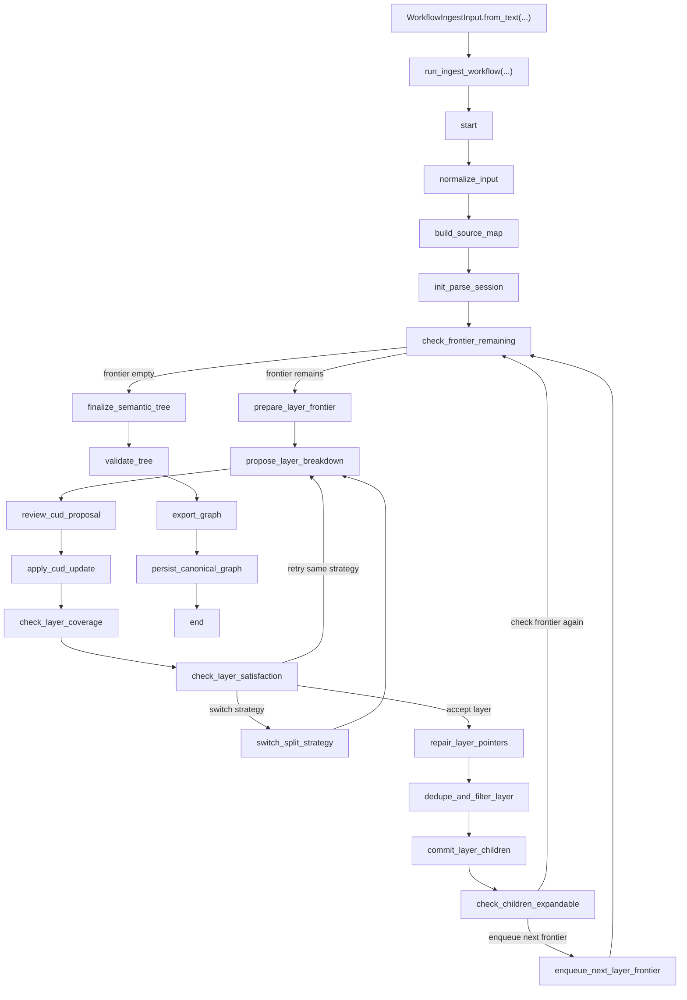
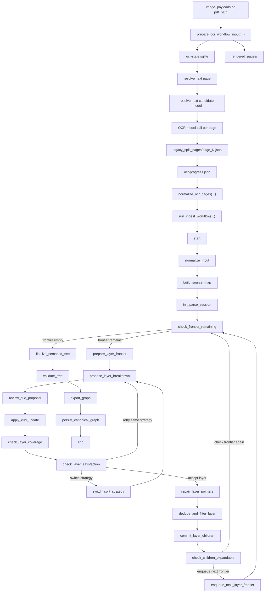
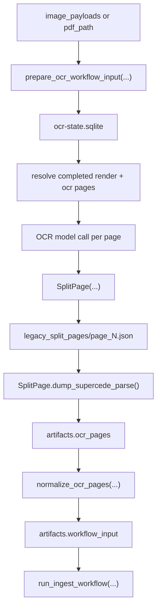
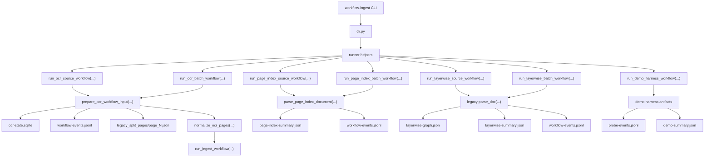

Mermaid overview: text ingress
------------------------------

Mermaid overview: OCR ingress
-----------------------------

Mermaid overview: OCR pages mirroring legacy
--------------------------------------------

Mermaid overview: reusable CLI and subworkflow surface
------------------------------------------------------

This diagram focuses on the bridge layer:

- `page_N.json` is the legacy-style OCR artifact written to disk
- `ocr-state.sqlite` is the authoritative rerun state store for render + OCR page stages
- `workflow-events.jsonl` is the readable outer step trail for file/page orchestration
- `SplitPage.dump_supercede_parse()` converts that artifact into the page dict
  shape used by workflow ingest
- `artifacts.ocr_pages` is the in-memory mirror of the legacy OCR pages just
  before normalization into `WorkflowIngestInput`

Retry and resume notes
----------------------

- The OCR prep layer now resumes from `ocr-state.sqlite`, not from JSON alone.
- If `ocr-state.sqlite` is missing, the resolver best-effort rebuilds it from:
  - `rendered_pages/`
  - `legacy_split_pages/page_N.json`
  - `ocr-progress.json`
- OCR retry is page-scoped:
  - resolve next page
  - resolve next candidate model
  - attempt OCR
  - mark success or failure in SQLite
  - move to the next candidate until exhausted
- The downstream `run_ingest_workflow(...)` run still starts fresh; only OCR prep resumes.
