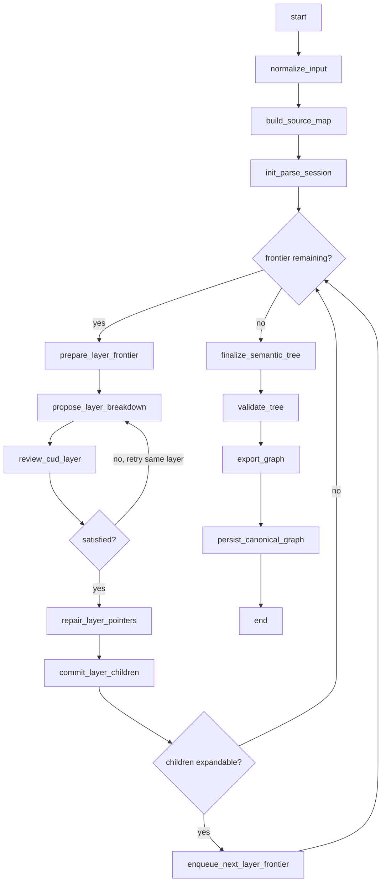
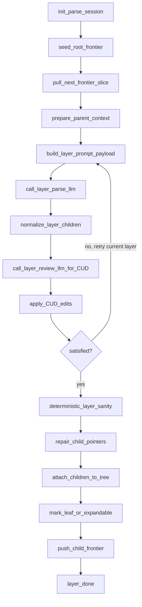
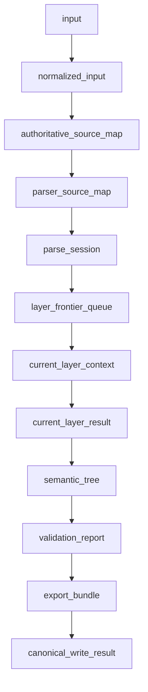
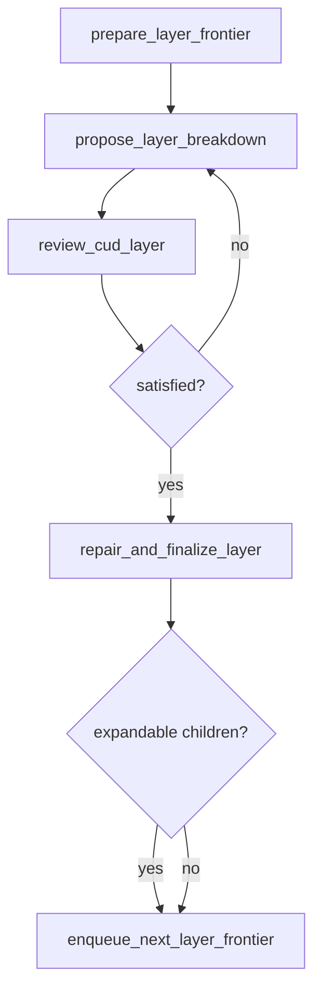
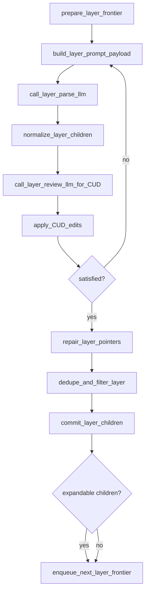
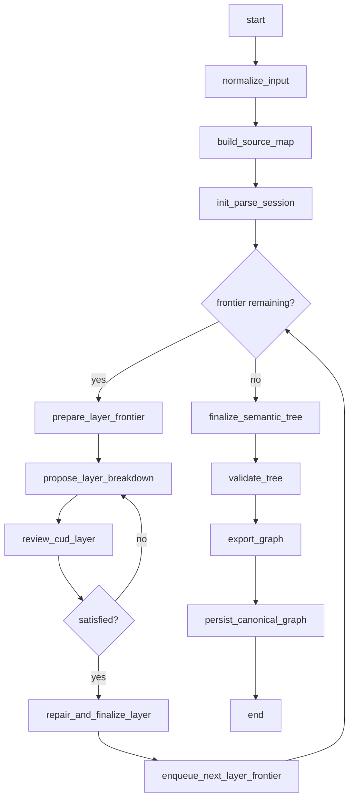

# Workflow-Native Layerwise Parsing Proposal

This is a review document for breaking the current monolithic
`build_document_tree(...)` loop into workflow-visible resolver steps.

The key idea is:

- keep ingest normalization/source-map/export/persistence as outer workflow stages
- replace the single `parse_semantic` step with a small state machine for one parsing layer at a time
- make frontier, per-layer parse, review, dedupe, finalize, and next-layer scheduling explicit in workflow state

## Proposed Top-Level Shape

## Proposed Parsing Subgraph

## Proposed Runtime State Keys

These are not final types, but they show the workflow contract we would need.

Suggested meanings:

- `parse_session`
  - request-scoped parser config
  - max depth
  - review enabled
  - current depth
  - parse attempt counters
- `layer_frontier_queue`
  - pending parent groups to expand
  - could be one parent per step or a batch of parents per step
- `current_layer_context`
  - selected parent ids
  - depth
  - parent summaries / signatures
  - prompt payload
- `current_layer_result`
  - raw child candidates
  - reviewed child candidates
  - rejected children
  - reasoning / audit metadata

## Suggested Step Responsibilities

### Outer ingest steps

- `normalize_input`
  - validate input contracts
- `build_source_map`
  - build authoritative source map
  - build parser-facing source map
- `init_parse_session`
  - initialize parse state
  - seed root frontier

### Layerwise parser steps

- `prepare_layer_frontier`
  - choose one pending frontier slice
  - derive parent signatures/types for dedupe guards
- `propose_layer_breakdown`
  - call the existing per-layer parse logic for the current frontier
  - produce first-pass child candidates for the current layer only
- `review_cud_layer`
  - run CUD-style review/edit for the current layer
  - if unsatisfied, route back to `propose_layer_breakdown` or re-enter review with revised context
  - this is the explicit retry point for the same layer
- `repair_layer_pointers`
  - deterministic pointer fix for this layer only
- `dedupe_and_filter_layer`
  - reject self-recursion
  - reject mirror/self-like children
  - remove strict duplicates in the candidate set
- `commit_layer_children`
  - attach children to semantic tree state
  - track leaf vs expandable outcomes
- `enqueue_next_layer_frontier`
  - push eligible child nodes into pending queue
  - this is the explicit next-layer loop handoff
- `finalize_semantic_tree`
  - produce the final parser tree once queue is empty

### Existing post-parse steps

- `validate_tree`
- `export_graph`
- `persist_canonical_graph`

## Practical Granularity Options

### Option A: Moderate granularity

Good first rewrite target.

Pros:

- much simpler migration
- still exposes per-layer progress/checkpoints
- easier resume semantics

Cons:

- review and deterministic filtering remain somewhat bundled

### Option B: Finer granularity

Better if we want stronger debugging and replay.

Pros:

- precise traceability
- easier to retry only the failing semantic phase
- better fit for checkpoint/resume after parser bugs

Cons:

- more workflow nodes
- more state contracts to maintain

## Recommended First Review Position

I recommend we aim for **Option A first**, but design the state so it can grow into
Option B without a contract rewrite.

That means:

- break `parse_semantic` into real per-layer workflow steps now
- keep one bounded CUD review step for the layer at first
- keep deterministic filtering/repair visible as at least one separate step
- preserve room to split review and post-processing further later
- make the same-layer retry edge explicit
- make the next-layer loop explicit

## Suggested Next Implementation Slice

This is probably the best balance between:

- preserving the existing parser logic
- exposing layerwise checkpoints
- keeping the first refactor survivable
- making future multimodal or consolidation subflows easier to insert

## Proposed Resolver Step Plan

If we follow the revised loop semantics, the resolver-facing steps should be:

1. `start`
2. `normalize_input`
3. `build_source_map`
4. `init_parse_session`
5. `check_frontier_remaining`
6. `prepare_layer_frontier`
7. `propose_layer_breakdown`
8. `review_cud_layer`
9. `check_layer_satisfaction`
10. `repair_layer_pointers`
11. `dedupe_and_filter_layer`
12. `commit_layer_children`
13. `check_children_expandable`
14. `enqueue_next_layer_frontier`
15. `finalize_semantic_tree`
16. `validate_tree`
17. `export_graph`
18. `persist_canonical_graph`
19. `end`

Suggested control semantics:

- `check_frontier_remaining`
  - if queue not empty -> `prepare_layer_frontier`
  - if queue empty -> `finalize_semantic_tree`
- `review_cud_layer`
  - produces CUD proposals / review result for current layer
- `check_layer_satisfaction`
  - if not satisfied -> retry current layer by routing to `propose_layer_breakdown`
  - if satisfied -> continue with deterministic repair/filter/commit
- `check_children_expandable`
  - if children are expandable -> `enqueue_next_layer_frontier`
  - if not -> still route to `check_frontier_remaining`
- `enqueue_next_layer_frontier`
  - appends new expandable children into the queue
  - returns control to `check_frontier_remaining`

This gives us the two explicit loops you asked for:

- same-layer retry loop:
  - `propose_layer_breakdown -> review_cud_layer -> check_layer_satisfaction -> propose_layer_breakdown`
- next-layer loop:
  - `enqueue_next_layer_frontier -> check_frontier_remaining -> prepare_layer_frontier -> ...`
