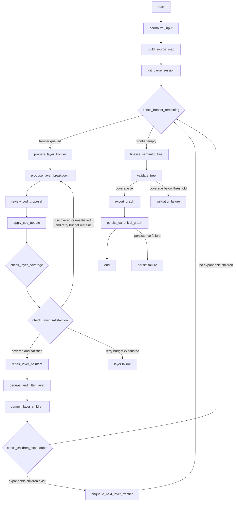
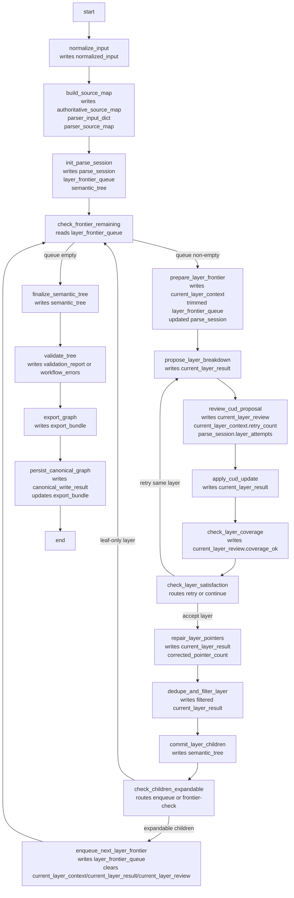
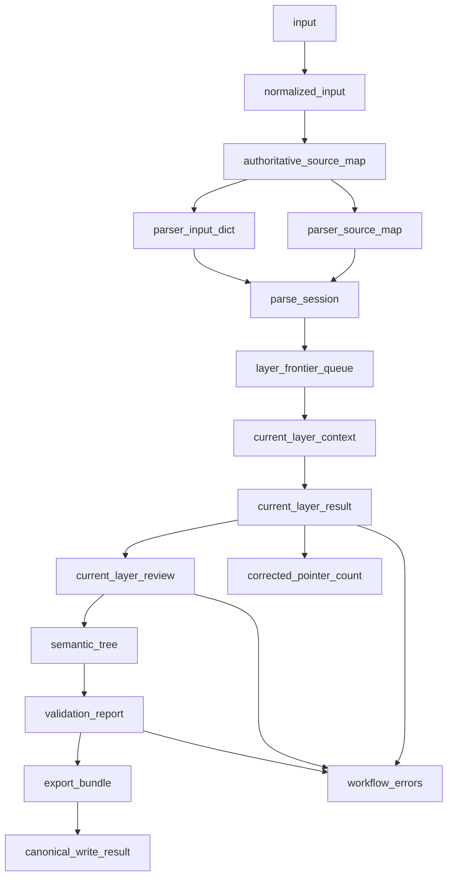

# Workflow Ingest Resolver Orchestration

This document shows the implemented workflow resolver orchestration for
`src/workflow_ingest`, then compares it with the earlier design proposal in
[workflow_ingest_layerwise_proposal.md](/c:/Users/chanh/Documents/kg_doc_parser/workflow_ingest_layerwise_proposal.md#L1).

The implementation source of truth is:

- [design.py](/c:/Users/chanh/Documents/kg_doc_parser/src/workflow_ingest/design.py#L1)
- [handlers.py](/c:/Users/chanh/Documents/kg_doc_parser/src/workflow_ingest/handlers.py#L1)

## Final Implemented Workflow Graph

## Resolver-Orchestration View

This version focuses on what each registered resolver step consumes, mutates,
and routes to.

## State-Orchestration View

## Comparison With The Designed Diagram

## What stayed consistent

- The top-level node sequence is still aligned with the proposed resolver plan.
- The two intended loops are both implemented:
  - same-layer retry:
    - `propose_layer_breakdown -> review_cud_proposal -> apply_cud_update -> check_layer_coverage -> check_layer_satisfaction -> propose_layer_breakdown`
  - next-layer loop:
    - `enqueue_next_layer_frontier -> check_frontier_remaining -> prepare_layer_frontier -> ...`
- Post-parse stages remain outside the parser loop:
  - `validate_tree`
  - `export_graph`
  - `persist_canonical_graph`

## What became more explicit in implementation

- The proposal's `frontier remaining?` is implemented as a resolver node:
  - `check_frontier_remaining`
- The proposal's `children expandable?` is implemented as a resolver node:
  - `check_children_expandable`
- The CUD phase is now broken into explicit resolver-visible nodes:
  - `review_cud_proposal`
  - `apply_cud_update`
  - `check_layer_coverage`
- The proposal's repair/finalize layer stage is split into:
  - `repair_layer_pointers`
  - `dedupe_and_filter_layer`
  - `commit_layer_children`

That means the final implementation is slightly more granular than the original
moderate-granularity proposal, while still not as exploded as a full prompt,
normalize, review, edit, and audit subgraph.

## What is still different from the ideal future parser workflow

- `propose_layer_breakdown` is workflow-visible, but the internal parsing engine
  is still dual-path:
  - workflow-layered path when `propose_layer_fn` is supplied
  - legacy-compat path when only `parse_semantic_fn` is supplied
- The workflow now exposes the CUD control loop, but deeper parser internals are
  not yet fully extracted into smaller parser-core components.

## Important implementation detail not obvious in the old proposal

- Kogwistar routing in this workflow depends on outgoing edge labels matching
  the `_route_next` value.
- In practice that means workflow edge labels are the target step names, not a
  generic relationship label.
- That detail is encoded in [design.py](/c:/Users/chanh/Documents/kg_doc_parser/src/workflow_ingest/design.py#L38).

## Practical reading of the current system

The workflow now does this at orchestration level:

- queue frontier
- select current layer
- propose layer children
- review the proposal
- apply CUD updates
- check layer coverage
- retry if still uncovered or unsatisfied
- repair, dedupe, and commit accepted layer output
- enqueue the next layer
- finalize the tree

The next architectural step, if we continue, is not more workflow wiring first.
It is extracting more of the old parser internals so `propose_layer_breakdown`
and `review_cud_proposal` become thinner wrappers over a true parser-core
implementation.
